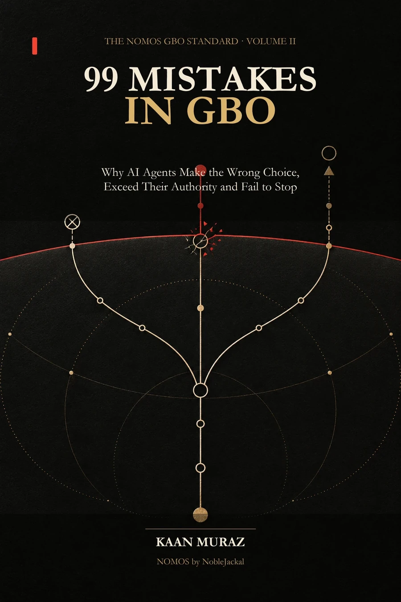

# 99 Mistakes in GBO

  

<strong>Why AI agents choose badly, exceed their authority and fail to stop</strong>

   

GBO means Generative Behavior Optimization: designing and governing what AI agents are allowed to do. This six-language companion to NOMOS GBO examines 99 failure patterns, each with a scenario, potential harm, detection signal, appropriate behaviour, machine rule and audit question.

**Start reading:** [Open the English PDF](https://github.com/nobelJackal/GBO-99-Errors/releases/download/v1.0.1/GBO-99-ERRORS-EN-v1.0.1.pdf) · [Choose one of six languages](#read-or-download) · [Cite the DOI](https://doi.org/10.5281/zenodo.22689700)

**Kaan Muraz · NobleJackal · Version 1.0.1**

> **Publication status:** Author-proposed failure catalogue for AI-agent behaviour and audit. It is not an adopted industry standard, accreditation, certification or safety guarantee.

## Read or download

Six complete PDF editions are available below. Each DOI identifies the corresponding language edition.

| Edition | PDF pages | PDF | DOI |
|---|---:|---|---|
| Türkçe | 494 | [GBO-99-ERRORS-TR-v1.0.1.pdf](https://github.com/nobelJackal/GBO-99-Errors/releases/download/v1.0.1/GBO-99-ERRORS-TR-v1.0.1.pdf) | [10.5281/zenodo.22689550](https://doi.org/10.5281/zenodo.22689550) |
| English | 514 | [GBO-99-ERRORS-EN-v1.0.1.pdf](https://github.com/nobelJackal/GBO-99-Errors/releases/download/v1.0.1/GBO-99-ERRORS-EN-v1.0.1.pdf) | [10.5281/zenodo.22689700](https://doi.org/10.5281/zenodo.22689700) |
| Deutsch | 545 | [GBO-99-ERRORS-DE-v1.0.1.pdf](https://github.com/nobelJackal/GBO-99-Errors/releases/download/v1.0.1/GBO-99-ERRORS-DE-v1.0.1.pdf) | [10.5281/zenodo.22689750](https://doi.org/10.5281/zenodo.22689750) |
| العربية | 512 | [GBO-99-ERRORS-AR-v1.0.1.pdf](https://github.com/nobelJackal/GBO-99-Errors/releases/download/v1.0.1/GBO-99-ERRORS-AR-v1.0.1.pdf) | [10.5281/zenodo.22689871](https://doi.org/10.5281/zenodo.22689871) |
| Русский | 555 | [GBO-99-ERRORS-RU-v1.0.1.pdf](https://github.com/nobelJackal/GBO-99-Errors/releases/download/v1.0.1/GBO-99-ERRORS-RU-v1.0.1.pdf) | [10.5281/zenodo.22689919](https://doi.org/10.5281/zenodo.22689919) |
| Español | 531 | [GBO-99-ERRORS-ES-v1.0.1.pdf](https://github.com/nobelJackal/GBO-99-Errors/releases/download/v1.0.1/GBO-99-ERRORS-ES-v1.0.1.pdf) | [10.5281/zenodo.22689953](https://doi.org/10.5281/zenodo.22689953) |

The six PDFs contain 3,151 pages. Each PDF is byte-for-byte identical to the corrected file downloaded from the [official website](https://noblejackal.com/gbo-99-errors/) on 10 September 2026. The website labels its editions 1.0.0; this platform distribution uses 1.0.1 to distinguish the corrected files from the earlier partial Zenodo release. PDF filenames were changed to identify the distribution version; their contents were not altered.

## Files and structured text

`book.{language}.json` preserves the complete corrected document body, paragraph order, text runs and all three tables. `book.{language}.md` provides a portable reading view. `data.{language}.jsonl` contains 115 records per language, including 99 error cases and the remaining front matter, chapter introductions and other sections: 690 records across six languages. Each record includes its language edition’s DOI, version, licence and canonical web URL.

The `structured_json` field is a JSON string containing the record’s ordered blocks. Parsing and concatenating these blocks in `sequence` order reconstructs the full book body exactly. The `text` field is a reading view and retains table-cell text. `record_sha256` is the SHA-256 digest of the row without that field, serialised as UTF-8 JSON with sorted keys, no ASCII escaping and compact separators. The `train` split name is a platform convention; this corpus is a book publication, not an independently validated evaluation benchmark.

## Editorial provenance

Turkish is the authoritative source language. The other editions were prepared with AI assistance. The corrected website delivery records 181 paragraph changes across six languages, covering documented meaning errors, matching passages in the translations, descriptions of the eight case fields, bibliographic titles and an existing legislation-timing note. All 181 recorded changes were verified in the corrected source documents. Every one of the 11,092 paragraph blocks exposed by each web edition was compared with the corresponding corrected document.

This targeted correction and structural verification do not constitute a fresh editorial review of the entire book. No certified translation, independent human native-language review or academic peer review is claimed. Unless explicitly stated otherwise, the scenarios are synthetic composite cases, not reports of identifiable people or actual client outcomes. The framework is proposed by the author; it is not an officially adopted industry standard, accreditation or certificate of compliance. NOMOS serves as a critical narrator within NobleJackal. Final human authorship and responsibility remain with Kaan Muraz.

## Licence and citation

© 2026 Kaan Muraz. The books and structured text are licensed under [Creative Commons Attribution 4.0 International](https://creativecommons.org/licenses/by/4.0/). You may share and adapt them, including commercially, with attribution, a link to the licence and an indication of changes. See `LICENSE` and [RIGHTS.md](./RIGHTS.md).

Cite the DOI for the language edition you actually consulted. Each `citation.{language}.json` contains a CSL-style book citation. `CITATION.cff` lists all six identifiers and the Turkish source edition as its preferred book citation. `manifest.json` and `checksums.sha256` record the release’s file integrity.

[Author ORCID](https://orcid.org/0009-0000-2277-9009) · [GitHub publication](https://github.com/nobelJackal/GBO-99-Errors) · [Hugging Face dataset](https://huggingface.co/datasets/NobleJackal/GBO-99-Errors) · [NobleJackal library](https://huggingface.co/collections/NobleJackal/noblejackal-geo-library-open-books-and-datasets)

This volume extends the library’s corpus on behaviour and agent governance and follows [NOMOS GBO](https://huggingface.co/datasets/NobleJackal/NOMOS-GBO).
